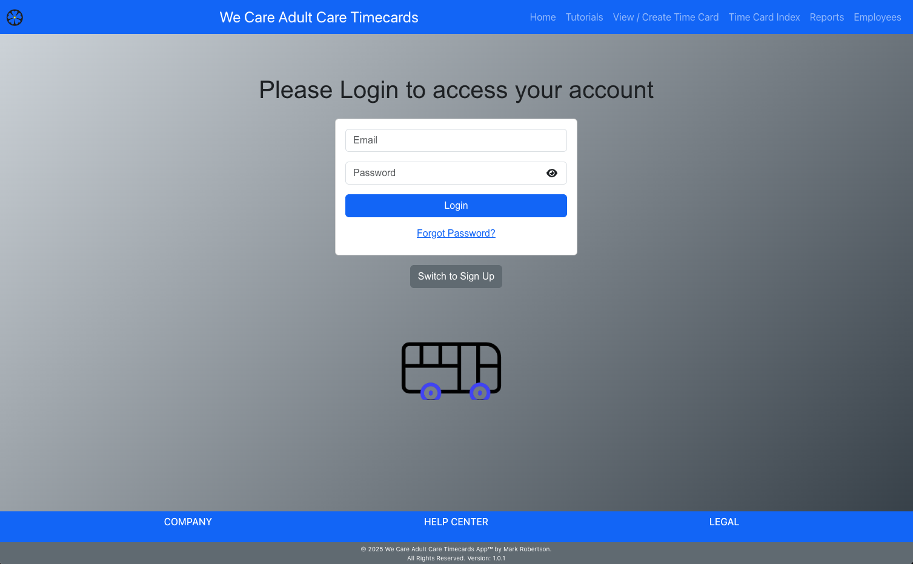
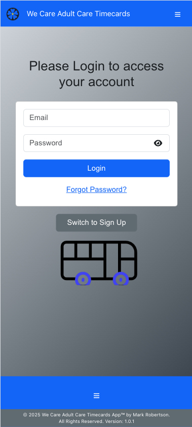
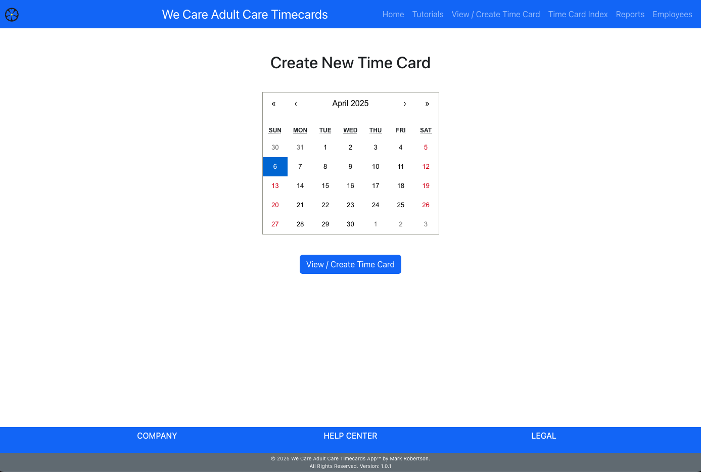
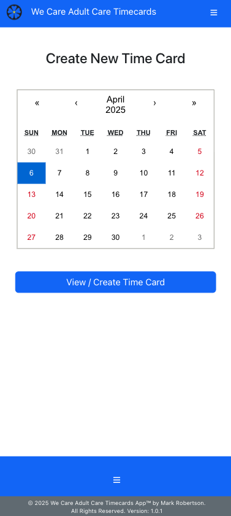
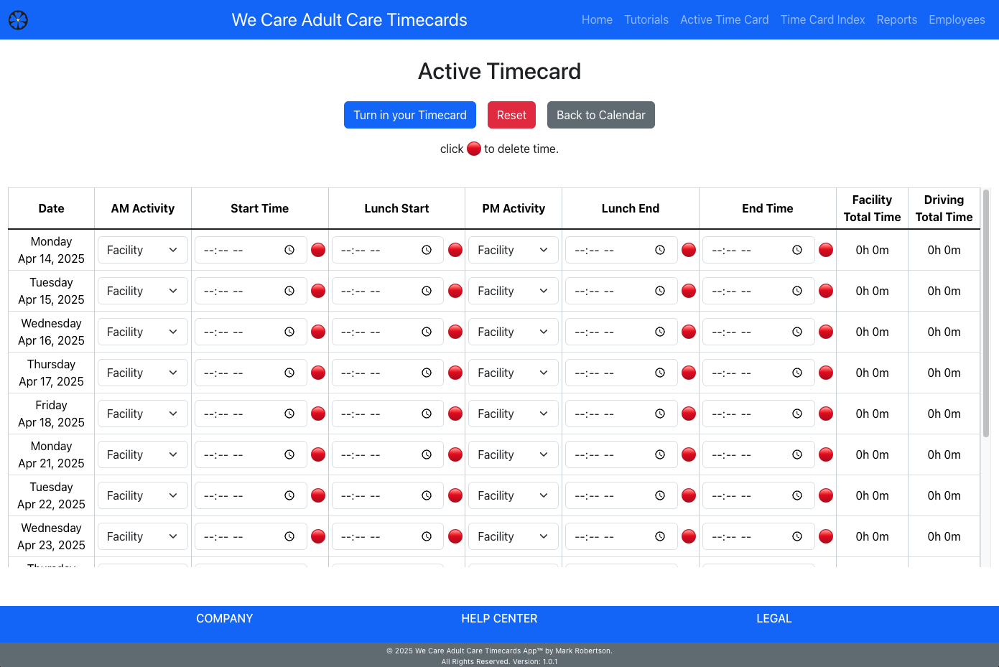
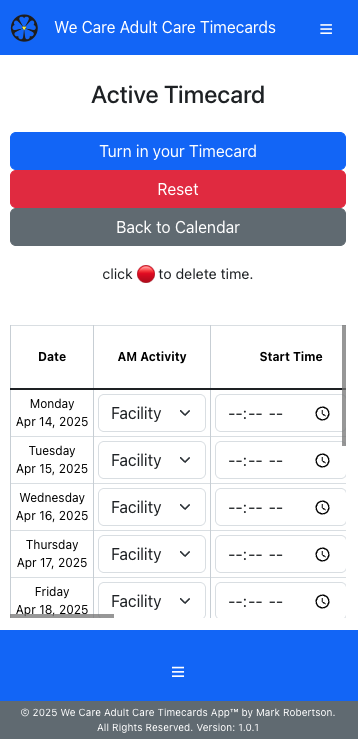
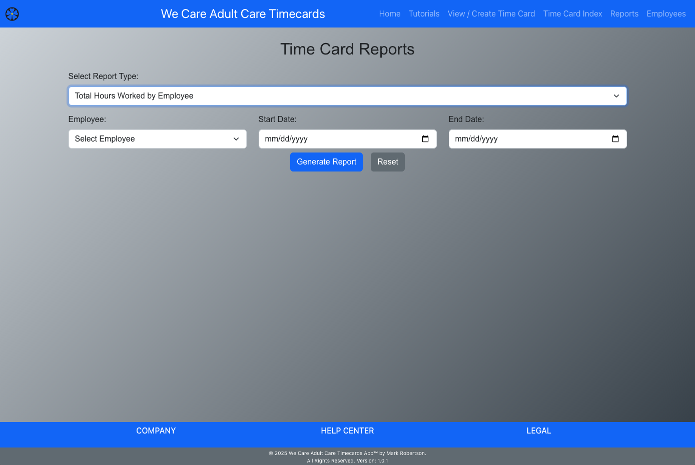
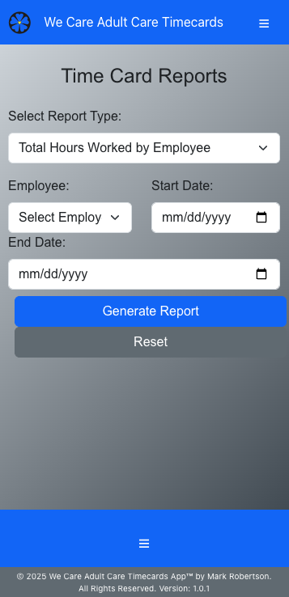
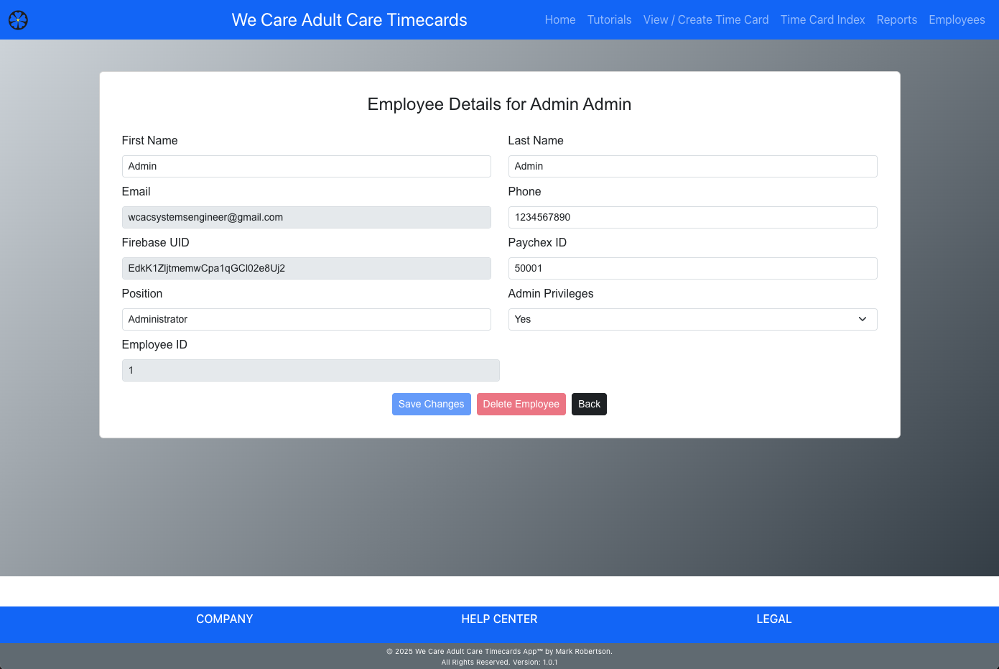
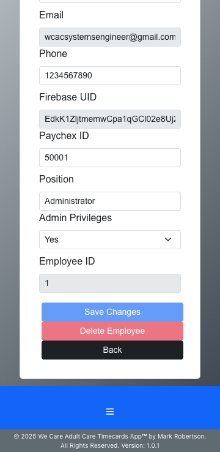

# Timecards App

## *Empowering Accurate, Efficient Employee Time Tracking*
> **Simplify Your Workflow with Precision and Speed**

<br/>

[](./LICENSE.txt)
<!-- [](https://github.com/markrobertson67/wcac_timecards_frontend/releases) -->
[](https://github.com/markrobertson67/wcac_timecards_frontend/blob/main/package.json)
[](https://app.netlify.com/sites/wcac-timecards/deploys)


## Table of Contents

- [Introduction](#introduction)
- [Features](#features)
- [Installation](#installation)
- [Usage](#usage)
  - [For Employees](#for-employees)
  - [For Administrators](#for-administrators)
- [Configuration](#configuration)
- [Backend Repository](#backend-repository)
- [License](#license)
- [Contact](#contact)

## Introduction

The WCAC Timecards App is a web-based solution designed to streamline timecard management and tracking for employees, tailored specifically for We Care Adult Care, Inc. Employees can register and authenticate using Firebase, enabling them to create, view, and generate reports for their own timecards over any chosen time period. Meanwhile, administrators have the ability to access detailed reports for individual employees or the entire workforce, review aggregate data, and manage employee profiles. This application significantly reduces the time needed to verify employee hours. At the end of the designated two-week cycle, employees submit their timecards, which locks the data and prompts the start of a new, 2-week, cycle. 

## Features

- **User Authentication:** Secure login, signup, and password reset functionality using Firebase Authentication.
- ** Protected routes can only be accessed once logged in.
- **Timecard Management:** Create, view, and manage daily timecards.
- **Detailed Reports:** Generate detailed and aggregated reports (by week, month, and year) for timecard entries.
- **Responsive Design:** Optimized for both desktop and mobile viewing.
- **CSV Export:** Save report data as CSV for export to PayChex.
- **Dynamic Footer & Navbar:** Consistent UI components that adjust responsively.
- **Real-Time Updates:** Automatic email verification handling and profile completion prompts.

| Feature                         | Employee | Administrator |
| ------------------------------- | -------- | ------------- |
| Dashboard Access                | ✔️       | ✔️            |
| Timecard Management             | ✔️       | ✔️            |
| Profile Editing                 | ✔️       | ✔️  Enhanced  |
| Submit Timecard                 | ✔️       | ✔️            |
| Manage Users                    | ❌       | ✔️            |
| Generate Reports                | ✔️       | ✔️  Enhanced  |
| Integration with Third-Party Apps | ❌     | ✔️            |
| Mobile Access                   | ✔️       | ✔️            |


## Installation

### Prerequisites:

- **Node.js and npm:**  
  [Download Node.js](https://nodejs.org/en/download/) (npm comes bundled with Node.js)  
  [Learn how to install Node.js and npm](https://docs.npmjs.com/downloading-and-installing-node-js-and-npm)

- **Git:**  
  [Download Git](https://git-scm.com/downloads)  
  [Git documentation](https://git-scm.com/doc)

- **Firebase:**  
  [Firebase Web Setup Guide](https://firebase.google.com/docs/web/setup)  
  [Firebase Documentation](https://firebase.google.com/docs)

- **EmailJS:**  
  [EmailJS Website](https://www.emailjs.com/)  
  [EmailJS Documentation](https://www.emailjs.com/docs/)


1. **Clone the repository:**

   ### Frontend

Clone the main repository:

  - git clone https://github.com/markrobertson67/wcac-timecards.git
    cd wcac-timecards

  ### Backend

  - git clone https://github.com/markrobertson67/wcac-timecards-backend.git
    cd wcac-timecards-backend

    Follow the instruction in this repo to set up the backend.


2. **Install dependencies:**

  - For the Frontend & Backend:  npm install


3. **Set up environment variables:**

    Both the frontend and backend require specific environment variables (e.g., API keys, Firebase configuration). You need to create a .env file in the root directory of each repository.

  ### Frontend Environment Variables

    - Create a file named .env in the wcac-timecards directory.

    - Add your environment-specific variables. 

    - For guidance on Firebase configuration, check out the [Firebase Web Setup Guide](https://firebase.google.com/docs/web/setup)

    An example of your environment variables might include:

```js
        // Set your API URL (adjust the port or URL as needed)
        REACT_APP_API_URL=http://localhost:3535

        // Firebase configuration (replace placeholder values with your project's actual configuration)
        const firebaseConfig = {
        REACT_APP_FIREBASE_API_KEY: "your_firebase_api_key",
        REACT_APP_FIREBASE_AUTH_DOMAIN: "your_project.firebaseapp.com",
        REACT_APP_FIREBASE_PROJECT_ID: "your_project_id",
        REACT_APP_FIREBASE_STORAGE_BUCKET: "your_project_storage_bucket.appspot.com",
        REACT_APP_FIREBASE_MESSAGING_SENDER_ID: "your_messaging_sender_id",
        REACT_APP_FIREBASE_APP_ID: "your_app_id"
};

```


  ### EmailJS Setup

  EmailJS allows you to send emails directly from your client-side code without exposing sensitive credentials. To set up EmailJS:

1. **Sign Up and Configure:**  
   If you haven't already, create an account on [EmailJS](https://www.emailjs.com/). Follow their dashboard instructions to configure your email service and templates.

2. **Add Your EmailJS Credentials:**  
   In your project, open src/components/pages/ContactUs.js and on line 26-40 update the email.js.send with your EmailJS configuration details. For example:

   ```js
        // Send the email using EmailJS
    emailjs
      .send(
        "service_your service number",
        "template_your template number",
        formData,
        "your account public key"
      )
   ```


  ### Backend Environment Variables

  - Create a .env file in the wcac-timecards-backend directory.

  - Add any required variables. These might include database connection strings, API keys, or other configuration settings.  
If you’re unsure which variables to add, consult the backend documentation or refer to [12 Factor App - Config](https://12factor.net/config) for best practices.

**Note:** Ensure that your `.env` file is added to your `.gitignore` file to keep your environment variables and sensitive credentials secure.


4. **Run the application locally:**

  Before you start, make sure both servers (frontend and backend) are running.

  ### Starting the Frontend

  In the wcac-timecards directory, run:

```
  npm start
```
This command will start the development server. You should then be able to access the application in your web browser, typically at http://localhost:3000.

### Starting the Backend

In the wcac-timecards-backend directory, run:

```
     npm start
```

Ensure the backend server is running. The frontend may depend on API endpoints provided by the backend.


5.  **Build for production:**

  When you're ready to deploy your application, you can build production-ready bundles.

  ### For the Frontend
```
     npm run build
  ```
This command creates an optimized production build. For more details, see the [Create React App Deployment Guide](https://create-react-app.dev/docs/deployment/).


  ### For the Backend

  If your backend needs to be built (or bundled), follow the instructions provided in its README or documentation.

## Usage

**For Employees:**

- **Login / Signup:**  
  Users can sign up or log in using their email and password.

  

  ### Home Page
  <table>
  <tr>
    <td align="center">
      
      <br><strong>Desktop View</strong>
    </td>
    <td align="center">
      
      <br><strong>Mobile View</strong>
    </td>
  </tr>
</table>


- **Create and Update Timecards:**  
  Once logged in, employees can create a new timecard by selecting a date from the calandar. 

  <table>
  <tr>
    <td align="center">
      
      <br><strong>Desktop View</strong>
    </td>
    <td align="center">
      
      <br><strong>Mobile View</strong>
    </td>
  </tr>
</table>

- They fill in their work schedule, and submit their timecard.

  <table>
  <tr>
    <td align="center">
      
      <br><strong>Desktop View</strong>
    </td>
    <td align="center">
      
      <br><strong>Mobile View</strong>
    </td>
  </tr>
</table>


- **View Detailed Reports:**  
  Employees can view their submitted timecards and detailed reports on the status of their entries.

  <table>
  <tr>
    <td align="center">
      
      <br><strong>Desktop View</strong>
    </td>
    <td align="center">
      
      <br><strong>Mobile View</strong>
    </td>
  </tr>
</table>

- **Employees:**
  Employees can view their details and update seclect fields, while administrators have acess to update most fields.

  <table>
  <tr>
    <td align="center">
      
      <br><strong>Desktop View</strong>
    </td>
    <td align="center">
      
      <br><strong>Mobile View</strong>
    </td>
  </tr>
</table>

## For Administrators

- **Access Reports:**  
  Admins have the ability to view aggregated reports (weekly, monthly, and yearly) for all employees.

- **Manage Profiles:**  
  Administrators can access and manage employee profiles, ensuring that all data is up-to-date.

-  **Export Data:**  
  Reports can be exported as CSV files for offline analysis and record keeping.

## Configuration

- **Firebase:**  
  The app uses Firebase for authentication. Update your Firebase configuration in the `firebaseConfig.js` file.

- **Backend API:**  
  Configure the API URL in the environment variable `REACT_APP_API_URL` in your `.env` file.

- **Styling:**  
  Custom styles are defined in the `ReportPage.module.css` and `NavBar.css` files. Modify these files to adjust the look and feel.

## Backend Repository

The backend for the WCAC Timecards App is available at [WCAC Timecards Backend](https://github.com/MarkRobertson67/wcac_timecards_backend).

## License

This project is licensed under the [Proprietary Software License](./LICENSE.txt).  
For licensing inquiries, please contact [Mark Robertson](mailto:markrobertson67@gmail.com).


## Contact

For any questions, support, or feedback, please contact Mark Robertson at [Mark Robertson](mailto:markrobertson67@gmail.com).

[](https://reactjs.org/)
[](https://developer.mozilla.org/en-US/docs/Web/CSS)
[](https://getbootstrap.com/)
[](https://developer.mozilla.org/en-US/docs/Web/JavaScript)
[](https://firebase.google.com/)
[](https://www.emailjs.com/)
[](https://git-scm.com/)
[](https://nodejs.org/)
